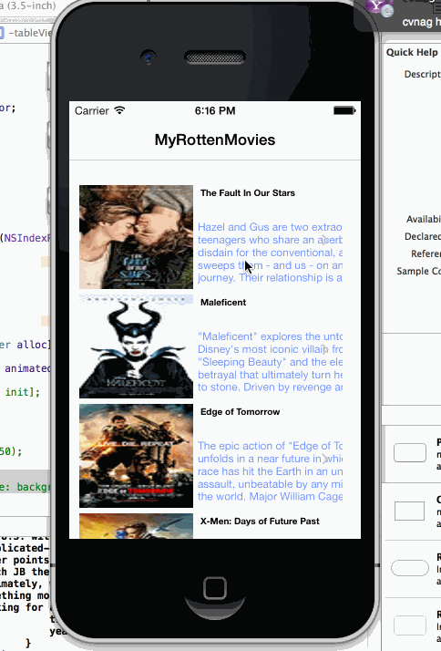

rottentomatesdemo
=================

This is a basic Rotten Tomates Application

ser Stories:

User can view a list of movies from Rotten Tomatoes.  Poster images must be loading asynchronously.
User can view movie details by tapping on a cell
User sees loading state while waiting for movies API.  You can use one of the 3rd party libraries here.
User sees error message when there's a networking error.  You may not use UIAlertView to display the error.  See this screenshot for what the error message should look like: network error screenshot.
User can pull to refresh the movie list.

Walkthrough of all user stories:

GIF created with [LiceCap](http://www.cockos.com/licecap/).

