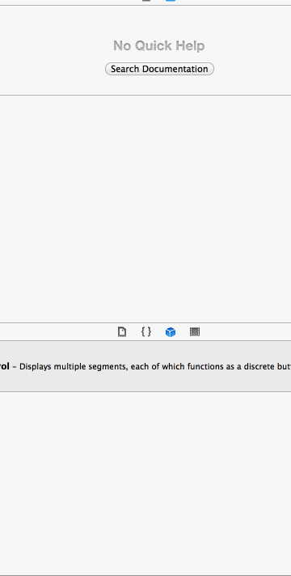

rottentomatesdemo
=================

This is a basic Rotten Tomates Application

I have spent 7 to 8 hours to complete this exercise. I have reviewed the persentation article couple of times, UI Controllers,controllers inside controllers, subviews, onselct methods,delegate methods,TableCell Afnetworking, cocoa pods, iToast,MBProgressHUD and also error handling.

I can do much better in terms of handling the optional stories, error handling, beautification of app in future assignments.

User Stories:

User can view a list of movies from Rotten Tomatoes.  Poster images must be loading asynchronously.
User can view movie details by tapping on a cell
User sees loading state while waiting for movies API.  Used MBProgressHUD here.
User sees error message when there's a networking error.  Used iToast here.
User can pull to refresh the movie list.

Walkthrough of all user stories:

GIF created with [LiceCap](http://www.cockos.com/licecap/).

